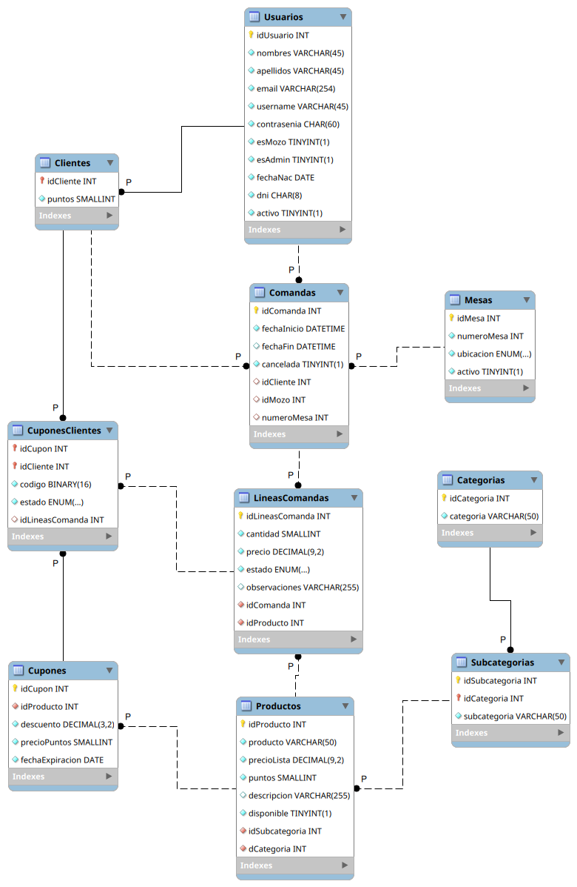

# LBD2026 GRUPO08 
## TP2
Alumnos:
* Huarachi Jorge Facundo
* Russo Francisco Agustín

### Cambios realizados con respecto al TP N°1:
| Elemento / Tabla | Modificación | Detalle del Cambio |
| :--- | :--- | :--- |
| **General** | **Nombre del esquema** | Cambió de `RomaLBD` a `LBD2026G08Roma`. |
| **General** | **Estructura de creación** | Se agregó `DROP TABLE IF EXISTS` antes de la creación de cada tabla. |
| **General** | **Claves Foráneas (FK)** | Todas las reglas `ON UPDATE NO ACTION` cambiaron a `ON UPDATE RESTRICT`. |
| **`Categorias`** | **Restricción `CHECK`** | Se agregó `CHECK (TRIM(categoria) <> '')` para evitar cadenas vacías. |
| **`Subcategorias`** | **Restricción `CHECK`** | Se agregó `CHECK (TRIM(subcategoria) <> '')`. |
| **`Subcategorias`** | **Índice único** | Se renombró a `Subcategorias_subcategoria_idCategoria_UNIQUE` y se invirtió el orden de las columnas (`idCategoria`, `subcategoria`). |
| **`Productos`** | **Restricción `CHECK`** | Se agregó `CHECK (TRIM(producto) <> '')`. |
| **`Productos`** | **Valor por defecto** | Se asignó `DEFAULT TRUE` a la columna `disponible`. |
| **`Productos`** | **Nuevos índices** | Se crearon índices individuales para `idSubcategoria` e `idCategoria`. |
| **`Usuarios`** | **Nueva columna** | Se incorporó `esMozo TINYINT(1) NOT NULL DEFAULT FALSE`. |
| **`Usuarios`** | **Restricción `CHECK`** | Se agregó validación para evitar cadenas vacías en las columnas `nombres`, `apellidos` y `username`. |
| **`Usuarios`** | **Cambio de tipo de dato** | La columna `contrasenia` pasó de `VARCHAR(60)` a `CHAR(60)`. |
| **`Usuarios`** | **Valores por defecto** | Se agregó `DEFAULT FALSE` a `esAdmin` y `activo`. |
| **`Clientes`** | **Renombre de columna** | La PK y FK `idUsuario` se renombró a `idCliente`. |
| **`Mozos`** | **Tabla eliminada** | Fue suprimida; su rol ahora se gestiona con la columna `esMozo` en la tabla `Usuarios`. |
| **`Cupones`** | **Ordenamiento** | La columna `idProducto` se movió a la segunda posición de la tabla. |
| **`Mesas`** | **Nueva Clave Primaria** | Se creó la columna `idMesa` (`INT AUTO_INCREMENT`) como nueva PK. |
| **`Mesas`** | **Modificación de columna** | `numeroMesa` dejó de ser PK y ahora tiene un índice `UNIQUE` explícito. |
| **`Mesas`** | **Valor por defecto** | Se agregó `DEFAULT TRUE` a la columna `activo`. |
| **`Comandas`** | **Actualización de FKs** | `idCliente` ahora apunta a `Clientes(idCliente)`. Se reemplazó `numeroMesa` por `idMesa`. `idMozo` ahora apunta directamente a `Usuarios(idUsuario)`. |
| **`CuponesClientes`** | **Renombre de columnas** | `Cupones_idCupon` cambió a `idCupon`, y `Clientes_Usuarios_idUsuario` cambió a `idCliente`. La PK se actualizó a estas nuevas columnas. |
| **`CuponesClientes`** | **Índice único explícito** | El modificador `UNIQUE` de la columna `codigo` se extrajo y se declaró explícitamente al final como un `CREATE UNIQUE INDEX`. |

### Modelo Físico Relacional Actualizado:

### Índices:

| Tabla | Nombre del Índice | Tipo | Columna(s) Indexada(s) |
| :--- | :--- | :--- | :--- |
| **Categorias** | `categoria_UNIQUE` | UNIQUE | `categoria` |
| **Subcategorias** | `Subcategorias_subcategoria_idCategoria_UNIQUE` | UNIQUE | `idCategoria`, `subcategoria` |
| **Productos** | `idx_Productos_producto` | INDEX | `producto` |
| **Usuarios** | `email_UNIQUE` | UNIQUE | `email` |
| **Usuarios** | `dni_UNIQUE` | UNIQUE | `dni` |
| **Usuarios** | `username_UNIQUE` | UNIQUE | `username` |
| **Usuarios** | `idx_Usuarios_nombres_apellidos` | INDEX | `nombres`, `apellidos` |
| **Mesas** | `numeroMesa_UNIQUE` | UNIQUE | `numeroMesa` |
| **Comandas** | `idx_Comandas_fechaInicio` | INDEX | `fechaInicio` |
| **Comandas** | `idx_Comandas_fechaFin` | INDEX | `fechaFin` |
| **LineasComandas** | `idx_LineasComandas_idComanda_estado` | INDEX | `idComanda`, `estado` |
| **CuponesClientes** | `codigo_UNIQUE` | UNIQUE | `codigo` |